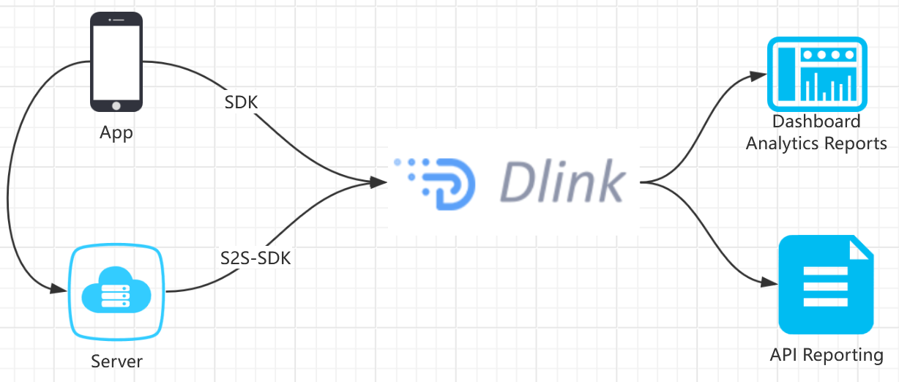

# S2S Event API

This article explains how to send event data from an advertiser's server to Dlink to measure mobile events that occur outside of the app.


###  Server-to-Server (S2S) Event API for Mobile Devices
The Dlink platform attributes and logs mobile app events sent by Dlink SDKs and APIs, allowing you to use the S2S API to report events that occur outside of your application (such as a renewal completed by a user on your website).
### Dlink will populate the following information into S2S events:

  * Values sent in the S2S message
  *  Partial attribution information from Dlink, such as activation time and media source.

For key events (like payments), you can use the Server-to-Server Event API for integration. To send events via API, please ask your developers to complete the relevant setup according to the Server-to-Server Event API.

# Integrating the SDK
Step 1: Obtain `Account ID` and `Dev Token`

Register an account at https://console.dlink.cloud. After creating an app on the platform, obtain the corresponding `Account ID` and `Dev Token` for App Setting.

Step 2: Obtain the SDK

(1) Configure the Maven repository

```xml

    <repositories>
        <repository>
            <id>deeplink</id>
            <name>deeplink</name>
            <url>https://maven.deeplink.dev/repository/maven-releases/</url>
        </repository>
    </repositories>
    
```
(2) Configuring the Maven coordinates of an SDK in `pom.xml`
```xml

<dependency>
  <groupId>dev.deeplink.sdk</groupId>
  <artifactId>server-sdk-java</artifactId>
  <version>2.2.1</version>
</dependency>

```

Step 3: Initialize the SDK

```java
 ApiContext CONTEXT = ApiContext.create("{Account ID}", "{Dev Token}")
            .setApiUrl("https://api.deeplink.dev/");

```

Step 4: Use the SDK

```java

   
    @Test
    public void testEventReport() {
        EventReportRequest request = new EventReportRequest();
        request.setActionSource(ActionSourceEnum.website.getCode());
        request.setEventId(String.valueOf(new Date().getTime()));
        request.setEventType(EventTypeEnum.AddToCartEvent.getCode());
        request.setEventSourceUrl("https://www.example.com/product/1");
        request.setEventTime(new Date().getTime());

        // Order
        EventReportRequest.OrderCustom customData = new EventReportRequest.OrderCustom();
        customData.setContents(Arrays.asList(new EventReportRequest.OrderCustom.Content()
            .setProductId("1")
            .setQuantity(1L)
            .setProductName("Product Name")));
        customData.setCurrency("USD");
        customData.setValue(100F);
        request.setCustomData(customData);

        // User information
        EventReportRequest.UserData userData = new EventReportRequest.UserData();
        userData.setExternalId("uid");
        userData.setPhones(Collections.singletonList("123456789"));
        userData.setEmails(Collections.singletonList("123456789@gmail.com"));
        request.setUserData(userData);

        Result<EventReportResponse> result = CONTEXT.execute(request);
        System.out.println("result: " + JSONUtil.toJsonStr(result));
    }
    
    @Test
    public void testUtmConfigQuery() {
        UtmConfigQueryRequest request = new UtmConfigQueryRequest();
        request.setUtmCode("tt_app");
        //tiktok app required
        request.setMediaAccountId("{tiktok Account Id}");
        final Result<UtmConfigResponse> result = CONTEXT.execute(request);
        System.out.println("result: " + JSONUtil.toJsonStr(result.getData()));
    }
```
